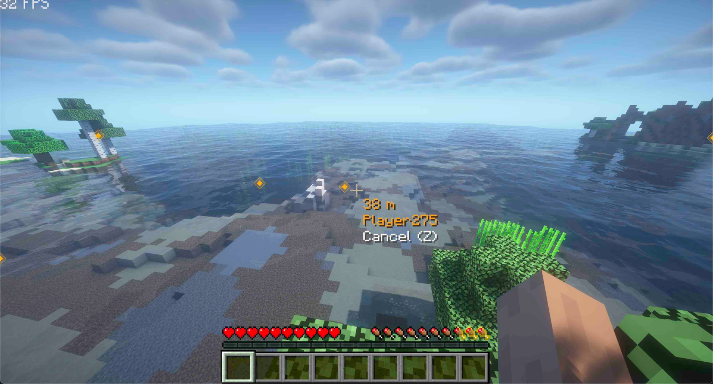
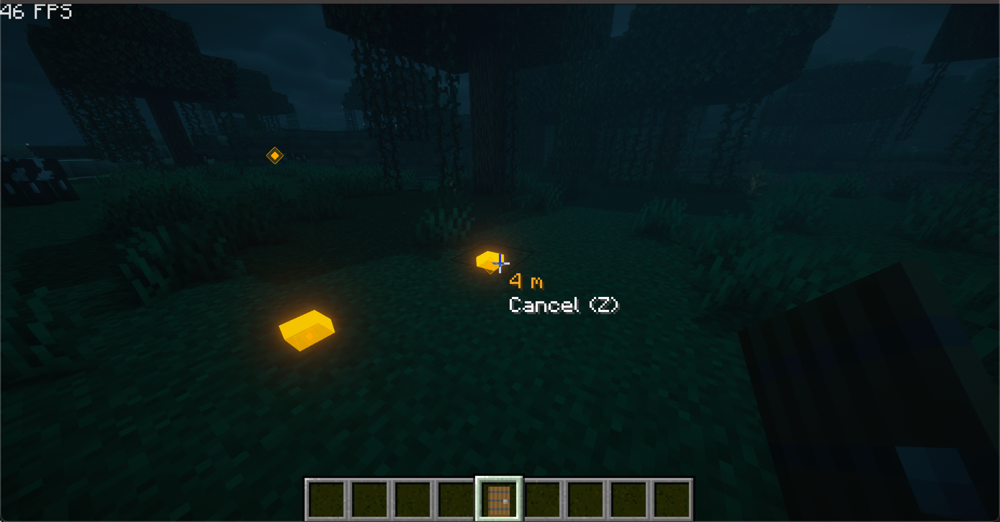

     

<h1 align="center">PingSystem</h1>

Ping System for Minecraft. Make MC Apex Again!

## Ping System

Default hotkey: `c`

Send signal to your team for communication.

Press hotkey again on the Ping Point to cancel it.

## Images

A ping from teammate:

Pings at night:

## Dependencies

malilib: [https://www.curseforge.com/minecraft/mc-mods/malilib](https://www.curseforge.com/minecraft/mc-mods/malilib)

## Todo

- [x] config for mod with mod menu
- [ ] get current key for info
- [ ] confirm ping of teammate
- [ ] ping entity
- [ ] fix NaN
- [ ] automatic pathfinding
- [ ] show on minimap
- [ ] support forge
- [x] support 1.19.2
